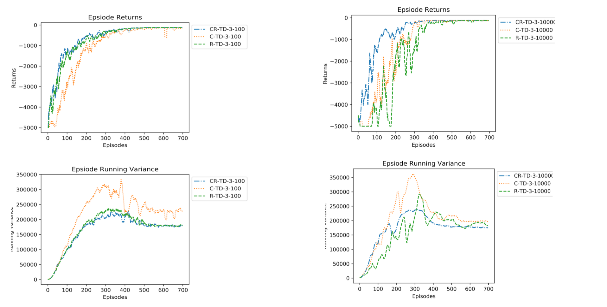

# refreshing-experiences-in-replay-buffer
A comparison and analysis of a refreshing strategy for experience replays.

## Usage
For GridWorld Experiments refer to [this](https://github.com/aman-mehra/refreshing-experiences-in-replay-buffer/blob/main/GridWorldExperiments/README.md).

For Atari and Cartpole Experiments refer to [this](https://github.com/aman-mehra/refreshing-experiences-in-replay-buffer/blob/main/AtariExperiments/README.md).

## Background
Recent advancements in replay buffers have sought to make reinforcement learning more sample efficient by proposing schemes that sample transitions which are more *on-policy* with respect to the current agent policy. Consquently, complex methods of using KL divergene based sampling heuristics and learnable sampling policies have been proposed. 

We instead ask the question - ***can refreshing the contents of a sampled transition to make it align with the current policy achieve improved sample efficient and thereby faster convergence?*** The answer turns out be ***yes***.

## Proposed Approach
The proposed approach tackles the problem of refreshing as follows - given a transition (*St*, *At*, *Rt*, *St+1*) and the current agent policy _&pi;_, before a training epoch we replace *At* with *Anewt = argmaxa &pi;(a | St)*, which is the greedy action the agent would take were it in state *St* at the current time step. Having updated *At*. we now reguire updating *Rt* and *St+1*. In a tabular setting this is straight forward since passing *St* and *Anewt* to the environment will provide us the new reward *Rnewt* and next state *Snewt+1*. In a continuous state space, this is trickier and will require the use of a forward dynamic model to estimate the next state as well as a model to capture the new reward. We have described an algorithm to do this using intrinsic motivation [here](https://github.com/aman-mehra/refreshing-experiences-in-replay-buffer/blob/main/Reports/Deep%20Refresh%20Algorithm.pdf), but so far have results on only tabular state spaces.

## Environment

A GridWorld Setup as described in the image below is used.

## Results 
Here some of the results of our experiments on the GridWorld setup can be seen. The complete results can be found [here](https://drive.google.com/file/d/1ZccWeYlOzYgvdjtLkBh3IpdW6quYbQYn/view?usp=sharing). We have plotted the episodic returns as well as the average episodic variance of the update. The refreshing scheme has been compared against a baseline uniform sampling scheme and the widely used combined experience replay buffer. What we see is that refreshing surpasses the baseline and matches CER. Moreover, it is a complementary approach that can be applied on top of sampling schemes. We tested this on top of CER seeing improvements.

The result plots are labelled as follows - <sampling scheme - C/R/U/CR> - <Learning Algorithm - Temporal Difference(TD) / Tree backup> - <Return Steps - 1 step/ 3 step> - <Replay Buffer Size - 100/1000/10000>

We see that for larger replay buffers the impact of refresh is greater. This is something that we expected since large buffers will contain stale transitions from much older policies. Due to this refresshing scheme more meaningful learning can take place leading to faster convergence as demonstrated.

### Uniform sampling (U) Vs Refreshing (R)

### Combined Experience Replay (C) Vs Refreshing (R)

### Combined Experience Replay + Refresh (CR) Vs Combined Experience Replay (C) Vs Refreshing (R)

## Insights and Future Direction
The video below shows an episodic histogram of the exploration of the state space conducted by the agent (w/ CER sampling) over its entire training run. It can be seen that for majority of training, the state exporation is fairly exhaustive over the state space. the agent only learns a shortest path route near convergence.

This indicates that the notion of the learning should be disentangled into two salient components - 
1. An agent should be driven to explore novel state space regions. This is covered by curiosity driven exploration.
2. Having explored some region, the agent should be able to quickly navigate (shortest path) to its known horizon of knowledge within the state space. This something that needs further work.

As a result, the goal of an agent shouldn’t simply be to reach the goal as quickly as possible but reach any position within its known navigable regions quickly. This ability coupled with curiosity should allow an agent to discover paths leading to its final goal quickly and efficiently.

With regards to the Gridworld, an agent should aim to be as efficient in the limit as a Breadth First traversal of the grid.

https://user-images.githubusercontent.com/32927086/147378046-c96b3837-6cb5-4a9e-9540-d68c7f8a5503.mp4

